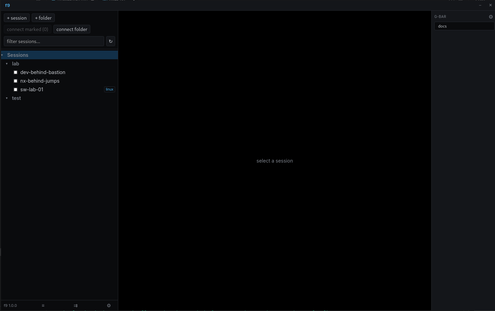

# f9

A cross-platform SSH client with a Go backend and a Wails v2 + xterm.js (Preact)
frontend. SecureCRT-inspired: a session tree with option inheritance, jump
chains, searchable scrollback, template-driven sending, multi-session broadcast,
and scriptable session import from external HTTPS sources (NetBox and friends).
Named after its launcher hotkey.

## Features

### Sessions & tree
- **Session tree** — folders with inherited connection options (Default Session
  → folder → nested folders → session); per-session overrides with provenance
  shown in the detail pane.
- **Jump chains** — multi-hop editor per session or per import source
  (inherited by every imported session). Two hop modes: **proxyjump** (tunnel
  through the hop) and **shell-hop** (run `ssh` on the hop's shell; the last
  hop's user override is the fallback onward login — a session's own user wins).
- **Alternative usernames** — named logins in Settings (`jump → jdoe`,
  `linux → u1234567`), referenced as `@label` in session users, hop users and
  overrides, resolved at connect; an optional per-label key file joins the auth
  candidates. Map scripts read them via `f9.alt_user("label")`.
- **Tree UX** — double-click connects; deep subfolder/session counters per
  folder; multi-connect checkboxes hidden behind a toolbar toggle; session
  filter with adaptive debounce and a capped result list.
- **Duplicate** — copy a session (options included) as a local, refresh-safe
  session, e.g. for a second login or a SOCKS-only variant.

### Terminals & connections
- **Terminals** — xterm.js with chunked scrollback, a virtual grep panel
  (Ctrl/Cmd+F), clipboard copy/paste (Ctrl/Cmd+Shift+C/V, middle-click primary
  paste), and a wheel-scrollable tab strip.
- **Multi-connect** — connect marked sessions or a whole folder; terminal tabs
  open as each connection lands.
- **Dead-link detection** — SSH keepalive with a bounded reply wait: a dropped
  VPN/wifi link is flagged in ~15 s (10 s default interval, per-session
  `keepaliveInterval` override). Dead tabs keep their scrollback, freeze input,
  and **Enter reconnects in place**; `close dead (N)` clears them all.
- **Connections panel** — live state per session, filter box, reconnect for
  failed dials (single or all), SOCKS badge (red on port-bind conflict).
- **SOCKS dynamic forwarding** — per-session `ssh -D` (`socksPort` option);
  **SOCKS-only sessions** connect without a terminal and live as their
  connections entry.

### Session import
- **Per-folder HTTPS sources** — f9-native / NetBox / mapped JSON; pagination;
  bearer / token-header / HTTP-basic / mTLS auth; credentials encrypted at rest
  (argon2id + NaCl secretbox); reconcile by hostname or external id.
- **Filters** — nested AND/OR rule groups over normalized attributes
  (status, role, site, tenant, model, …) and NetBox custom fields.
- **Lua map scripts** — a sandboxed `map(r)` hook shapes every record: rename,
  drop, set users, build a nested folder tree from `r.folder`. See
  [`docs/import-map-scripts.md`](docs/import-map-scripts.md).
- **Nested folder trees** — `r.folder` paths create folders under the source,
  sessions move on change, emptied auto-created folders are pruned; name
  uniqueness is per leaf, so per-site duplicates coexist.
- **Safety** — a refresh that decodes 0 records leaves the tree untouched;
  clearing a source asks for confirmation; imported sessions are locally
  editable (core fields revert on the next refresh).
- **Fast, honest testing** — the test button fetches pages only until it has a
  representative sample of matches and labels partial results as a preview;
  refresh is cancelable with a per-folder spinner and status dialog.

### Environment
- **Passive OS detection** — per-session prompt/error tuning from
  `configs/os-tunings.yaml` (embedded in the binary).
- **Themes** — TOML colour schemes, iTerm2 import.
- **Variables & templates** — scoped, OS-tagged variables (secret keys
  rejected); pongo2 templates; prompt-for-unresolved on send.
- **Button bars** — a global **G-Bar** and a contextual **C-Bar**
  (folder / detected-OS); send / snippet / launch / URL actions.
- **Snippet library** — standalone tree, editor, and a Ctrl/Cmd+P fuzzy picker.
- **Multi-send** — broadcast a line or template to marked tabs with a live
  per-target feedback matrix (sent → echoed → ok / error / timeout), dry-run,
  and guard rails.
- **Update check** — polls GitHub Releases and offers a download when a newer
  build is available.

Feature bars (button bars, templates, snippets, multi-send, vertical layout) are
off by default and enabled in Settings. Esc closes any modal.

## Build & run

Requires Go 1.25+, Node 20+, and the Wails v2 CLI. On Debian/Ubuntu the GUI needs
WebKitGTK 4.1:

    sudo apt-get install -y libgtk-3-dev libwebkit2gtk-4.1-dev
    go install github.com/wailsapp/wails/v2/cmd/wails@v2.12.0

Then:

    make check        # go build + vet + gofmt + test
    make gui-dev      # run the GUI in dev mode
    make gui-build    # build the GUI binary -> build/bin/f9-gui

The in-app version comes from the `VERSION` file, injected at build time via
`-ldflags`. On Linux, `f9-gui --install-icons` installs a desktop launcher and
icon for the current user.

## Versioning & releases

- `make bump V=1.2.3` — writes `VERSION`, commits, and tags `v1.2.3`.
- `git push --follow-tags` triggers the release workflow: it builds five targets
  (linux amd64/arm64, windows amd64/arm64, macOS arm64) on native GitHub runners
  and publishes a GitHub Release with the assets.
- A weekly workflow cuts an automatic patch release each Sunday.

### Runtime dependencies

Wails uses the platform webview, so the binaries are not fully static:

- **Linux** — needs `libwebkit2gtk-4.1-0` and `libgtk-3-0` installed.
- **Windows** — needs the WebView2 runtime (present on Windows 11 and most Windows 10).
- **macOS** — self-contained `.app` (system WKWebView).

## Layout

    cmd/f9/                  CLI harness
    internal/store/          session/folder store, option inheritance, filters, reconcile
    internal/scrollback/     chunked ring buffer, grep iterator
    internal/sshx/           transport, auth chain, jump chains, keepalive, SOCKS proxy
    internal/connmgr/        connection lifecycle, state events
    internal/osdetect/       passive OS fingerprinting + tunings
    internal/vars/           scoped, OS-tagged variables
    internal/snippets/       template rendering + snippet library
    internal/buttonbar/      G-Bar / C-Bar model
    internal/multisend/      broadcast feedback state machine
    internal/sessionimport/  HTTPS fetch + decode (native / netbox / mapped)
    internal/luamap/         sandboxed Lua map-script engine + script library
    internal/cred/           passphrase-locked credential store (argon2id + secretbox)
    internal/updater/        GitHub release update check
    internal/theme/          TOML schemes, iTerm2 import
    internal/app/            Wails bindings
    frontend/                Preact + xterm.js UI

Architecture decisions live in [`docs/adr/`](docs/adr/); the import map-script
guide in [`docs/import-map-scripts.md`](docs/import-map-scripts.md).

## License

f9 is licensed under the **GNU General Public License v3.0** — see [`LICENSE`](LICENSE).

All third-party dependencies are under GPLv3-compatible licenses (MIT,
BSD-2/3-Clause, Apache-2.0), and the bundled fonts (Inter, JetBrains Mono) under
the SIL Open Font License 1.1. Generate a full dependency license manifest with:

    go install github.com/google/go-licenses@latest
    go-licenses report ./... > THIRD_PARTY_LICENSES.txt
